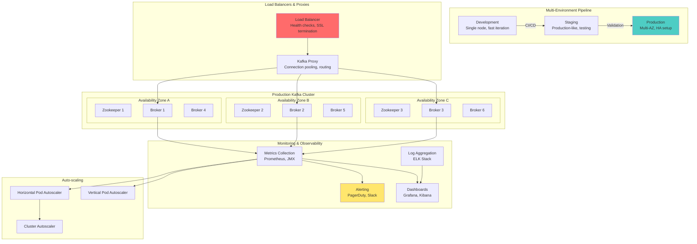
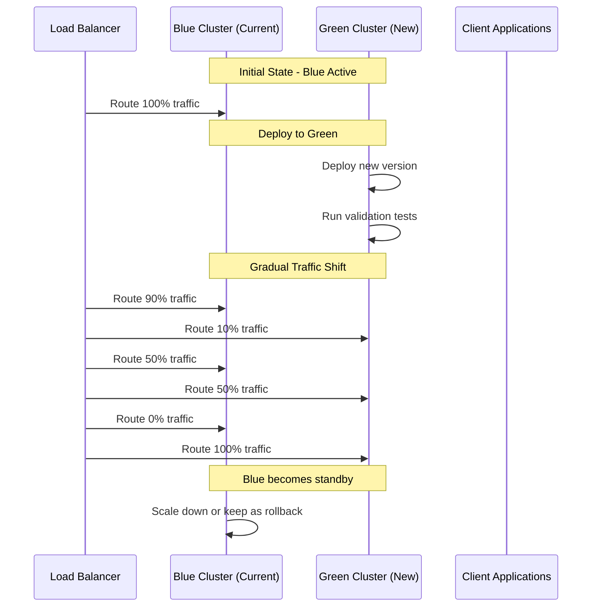
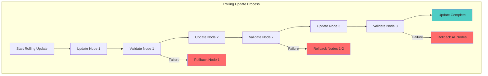
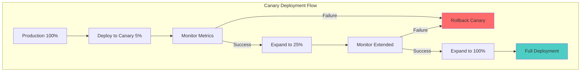
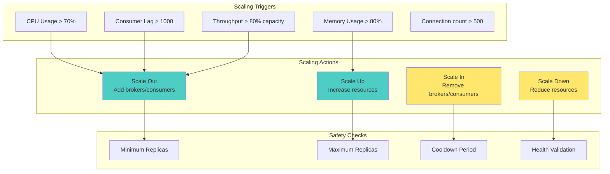
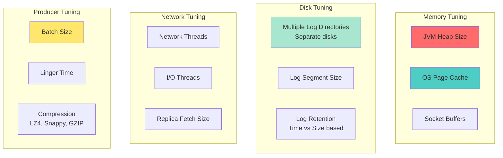
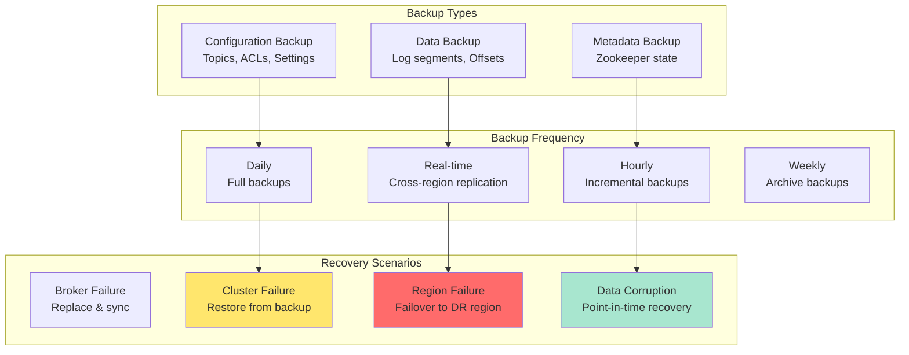

# Workshop: Deployment & Scaling Best Practices

## 🎯 Objective  
Master production deployment strategies, auto-scaling patterns, and operational best practices for running Kafka clusters at scale in cloud and on-premises environments.

## 📋 Workshop Tasks

### Task 1: Deployment Strategies
Implement deployment automation in `deployment/DeploymentManager.kt`

### Task 2: Auto-scaling Configuration  
Build auto-scaling logic in `scaling/AutoScaler.kt`

### Task 3: Performance Tuning
Optimize configurations in `tuning/PerformanceTuner.kt`

### Task 4: Operational Runbooks
Create operational procedures in `operations/RunbookManager.kt`

### Task 5: Disaster Recovery
Implement DR procedures in `disaster/DisasterRecoveryManager.kt`

## 🏗️ Production Deployment Architecture


## 🚀 Deployment Strategies

### 1. **Blue-Green Deployment**


### 2. **Rolling Deployment**


### 3. **Canary Deployment**


## ⚖️ Auto-scaling Strategies

### Horizontal Scaling Metrics


### Consumer Auto-scaling
```kotlin
@Component
class KafkaConsumerAutoScaler {
    
    fun evaluateScaling(groupId: String): ScalingDecision {
        val metrics = consumerGroupMetrics.getMetrics(groupId)
        val avgLag = metrics.partitions.map { it.lag }.average()
        val processingRate = metrics.processingRate
        val currentInstances = metrics.activeConsumers
        
        return when {
            avgLag > 1000 && currentInstances < maxInstances -> {
                ScalingDecision.SCALE_OUT(
                    targetInstances = minOf(currentInstances + 1, maxInstances),
                    reason = "High consumer lag detected: $avgLag"
                )
            }
            avgLag < 100 && currentInstances > minInstances -> {
                ScalingDecision.SCALE_IN(
                    targetInstances = maxOf(currentInstances - 1, minInstances),
                    reason = "Low consumer lag: $avgLag"
                )
            }
            processingRate < 0.5 && currentInstances > minInstances -> {
                ScalingDecision.SCALE_IN(
                    targetInstances = maxOf(currentInstances - 1, minInstances),
                    reason = "Low processing rate: $processingRate"
                )
            }
            else -> ScalingDecision.NO_ACTION("Metrics within acceptable range")
        }
    }
}
```

## 🔧 Performance Tuning

### Broker Configuration Optimization


### Performance Tuning Matrix
```kotlin
data class PerformanceTuningConfig(
    // Memory Configuration
    val heapSize: String = "6g",
    val pageCacheSize: String = "auto", // 50% of system RAM
    
    // Thread Configuration  
    val networkThreads: Int = 3,
    val ioThreads: Int = 8,
    val backgroundThreads: Int = 10,
    
    // Log Configuration
    val logSegmentBytes: Long = 1073741824, // 1GB
    val logRetentionHours: Int = 168, // 7 days
    val logRollMs: Long = 604800000, // 7 days
    
    // Replication Configuration
    val replicaFetchMaxBytes: Int = 1048576, // 1MB
    val replicaFetchWaitMaxMs: Int = 500,
    val replicaLagTimeMaxMs: Long = 30000,
    
    // Producer Optimization
    val batchSize: Int = 65536, // 64KB
    val lingerMs: Int = 5,
    val compressionType: String = "lz4",
    val acks: String = "all",
    
    // Consumer Optimization
    val fetchMinBytes: Int = 1024, // 1KB
    val fetchMaxWaitMs: Int = 500,
    val maxPollRecords: Int = 500,
    val maxPartitionFetchBytes: Int = 1048576 // 1MB
) {
    
    fun generateBrokerConfig(): Properties {
        return Properties().apply {
            // Memory settings
            setProperty("heap.opts", "-Xmx$heapSize -Xms$heapSize")
            
            // Thread settings
            setProperty("num.network.threads", networkThreads.toString())
            setProperty("num.io.threads", ioThreads.toString())
            setProperty("background.threads", backgroundThreads.toString())
            
            // Log settings
            setProperty("log.segment.bytes", logSegmentBytes.toString())
            setProperty("log.retention.hours", logRetentionHours.toString())
            setProperty("log.roll.ms", logRollMs.toString())
            
            // Replication settings
            setProperty("replica.fetch.max.bytes", replicaFetchMaxBytes.toString())
            setProperty("replica.fetch.wait.max.ms", replicaFetchWaitMaxMs.toString())
            setProperty("replica.lag.time.max.ms", replicaLagTimeMaxMs.toString())
        }
    }
}
```

## ✅ Success Criteria
- [ ] Multi-environment deployment pipeline working
- [ ] Auto-scaling responds correctly to load changes
- [ ] Performance tuning achieves target throughput/latency
- [ ] Blue-green deployment tested and documented
- [ ] Disaster recovery procedures tested and validated
- [ ] Monitoring and alerting covers all critical metrics
- [ ] Operational runbooks complete and accessible

## 🚀 Getting Started

### 1. Infrastructure as Code
```yaml
# Terraform example for AWS
resource "aws_msk_cluster" "kafka_cluster" {
  cluster_name           = "kafka-production"
  kafka_version         = "2.8.1"
  number_of_broker_nodes = 6
  
  broker_node_group_info {
    instance_type   = "kafka.m5.xlarge"
    ebs_volume_size = 1000
    client_subnets = [
      aws_subnet.private_a.id,
      aws_subnet.private_b.id,
      aws_subnet.private_c.id,
    ]
    security_groups = [aws_security_group.kafka.id]
  }
  
  encryption_info {
    encryption_at_rest_kms_key_id = aws_kms_key.kafka.arn
    encryption_in_transit {
      client_broker = "TLS"
      in_cluster    = true
    }
  }
  
  configuration_info {
    arn      = aws_msk_configuration.kafka_config.arn
    revision = aws_msk_configuration.kafka_config.latest_revision
  }
  
  logging_info {
    broker_logs {
      cloudwatch_logs {
        enabled   = true
        log_group = aws_cloudwatch_log_group.kafka.name
      }
      s3 {
        enabled = true
        bucket  = aws_s3_bucket.kafka_logs.id
        prefix  = "kafka-broker-logs"
      }
    }
  }
  
  tags = {
    Environment = "production"
    Team        = "platform"
  }
}
```

### 2. Kubernetes Deployment
```yaml
apiVersion: apps/v1
kind: StatefulSet
metadata:
  name: kafka
spec:
  serviceName: kafka-headless
  replicas: 6
  selector:
    matchLabels:
      app: kafka
  template:
    metadata:
      labels:
        app: kafka
    spec:
      affinity:
        podAntiAffinity:
          requiredDuringSchedulingIgnoredDuringExecution:
          - labelSelector:
              matchLabels:
                app: kafka
            topologyKey: kubernetes.io/hostname
      containers:
      - name: kafka
        image: confluentinc/cp-kafka:7.4.0
        ports:
        - containerPort: 9092
        env:
        - name: KAFKA_BROKER_ID
          valueFrom:
            fieldRef:
              fieldPath: metadata.name
        - name: KAFKA_ZOOKEEPER_CONNECT
          value: "zookeeper:2181"
        - name: KAFKA_ADVERTISED_LISTENERS
          value: "PLAINTEXT://$(POD_IP):9092"
        resources:
          requests:
            memory: "4Gi"
            cpu: "1"
          limits:
            memory: "8Gi"
            cpu: "2"
        volumeMounts:
        - name: kafka-storage
          mountPath: /var/lib/kafka/data
  volumeClaimTemplates:
  - metadata:
      name: kafka-storage
    spec:
      accessModes: ["ReadWriteOnce"]
      resources:
        requests:
          storage: 1000Gi
      storageClassName: fast-ssd
```

### 3. Monitoring Setup
```yaml
# Prometheus monitoring
apiVersion: v1
kind: ServiceMonitor
metadata:
  name: kafka-metrics
spec:
  selector:
    matchLabels:
      app: kafka
  endpoints:
  - port: metrics
    interval: 30s
    path: /metrics
    
---
apiVersion: monitoring.coreos.com/v1
kind: PrometheusRule
metadata:
  name: kafka-alerts
spec:
  groups:
  - name: kafka
    rules:
    - alert: KafkaBrokerDown
      expr: up{job="kafka"} == 0
      for: 1m
      labels:
        severity: critical
      annotations:
        summary: "Kafka broker is down"
        
    - alert: KafkaConsumerLag
      expr: kafka_consumer_lag_sum > 1000
      for: 5m
      labels:
        severity: warning
      annotations:
        summary: "High consumer lag detected"
        
    - alert: KafkaDiskUsage
      expr: kafka_log_size_bytes / kafka_log_size_limit_bytes > 0.85
      for: 5m
      labels:
        severity: warning
      annotations:
        summary: "Kafka disk usage is high"
```

## 💾 Disaster Recovery

### Backup Strategies


### Recovery Procedures
```kotlin
@Service
class DisasterRecoveryService {
    
    fun executeRecoveryPlan(scenario: DisasterScenario): RecoveryResult {
        return when (scenario) {
            DisasterScenario.BROKER_FAILURE -> {
                replaceFailedBroker()
            }
            DisasterScenario.CLUSTER_FAILURE -> {
                restoreFromBackup()
            }
            DisasterScenario.REGION_FAILURE -> {
                failoverToDisasterRecoveryRegion()
            }
            DisasterScenario.DATA_CORRUPTION -> {
                performPointInTimeRecovery()
            }
        }
    }
    
    private fun replaceFailedBroker(): RecoveryResult {
        // 1. Provision new broker
        // 2. Configure with same broker.id
        // 3. Start broker and let it sync
        // 4. Verify all partitions are replicated
        return RecoveryResult.success("Broker replaced and synced")
    }
    
    private fun restoreFromBackup(): RecoveryResult {
        // 1. Stop all applications
        // 2. Restore Zookeeper state
        // 3. Restore Kafka log directories
        // 4. Start cluster in order
        // 5. Verify data integrity
        return RecoveryResult.success("Cluster restored from backup")
    }
}
```

## 🎯 Best Practices

### Deployment Excellence
- **Infrastructure as Code** - Use Terraform, CloudFormation, or Pulumi
- **Immutable deployments** - Never modify running instances
- **Gradual rollouts** - Use canary or blue-green strategies
- **Automated validation** - Test every deployment automatically

### Scaling Wisdom
- **Proactive monitoring** - Scale before hitting limits
- **Predictable patterns** - Use historical data for planning
- **Cost optimization** - Balance performance with cost
- **Capacity planning** - Plan for peak loads and growth

### Operational Excellence
- **Runbook automation** - Automate common operational tasks
- **Incident response** - Have clear escalation procedures
- **Performance baselines** - Know your normal operating parameters
- **Regular testing** - Test disaster recovery procedures regularly

## 🔍 Troubleshooting

### Common Production Issues
1. **Memory leaks** - Monitor heap usage and GC patterns
2. **Network partitions** - Implement proper timeouts and retries
3. **Disk space** - Monitor log growth and implement retention
4. **Consumer lag** - Scale consumers or optimize processing

### Operational Commands
```bash
# Check cluster health
kafka-broker-api-versions --bootstrap-server localhost:9092

# Monitor resource usage
kafka-run-class kafka.tools.JmxTool \
  --object-name kafka.server:type=BrokerTopicMetrics,name=MessagesInPerSec

# Graceful shutdown
kafka-server-stop

# Rolling restart
kubectl rollout restart statefulset/kafka
```

## 🎉 Curriculum Complete!

**Congratulations!** You've completed the comprehensive Kafka Mastery Curriculum! You now have the skills to:

✅ **Design** event-driven architectures from scratch  
✅ **Build** production-ready Kafka applications  
✅ **Scale** systems to handle millions of events  
✅ **Secure** clusters with enterprise-grade security  
✅ **Monitor** and operate Kafka in production  
✅ **Deploy** with confidence using modern DevOps practices  

## 🚀 What's Next?

### Continue Learning
- **Advanced Kafka Connect** - Integration with external systems
- **KSQL** - SQL for stream processing
- **Multi-datacenter replication** - Global event streaming
- **Custom serializers** - Specialized data formats

### Apply Your Skills
- **Build real projects** - Apply concepts to your work
- **Contribute to community** - Share your learning journey
- **Mentor others** - Help developers learn Kafka
- **Stay updated** - Follow Kafka development and best practices

---

*"From Kafka beginner to production expert - you've mastered one of the most important technologies in modern software architecture. Now go build amazing systems!"* 🚀