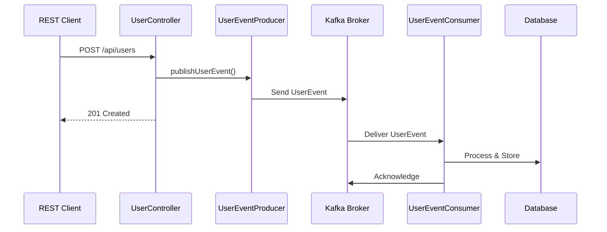
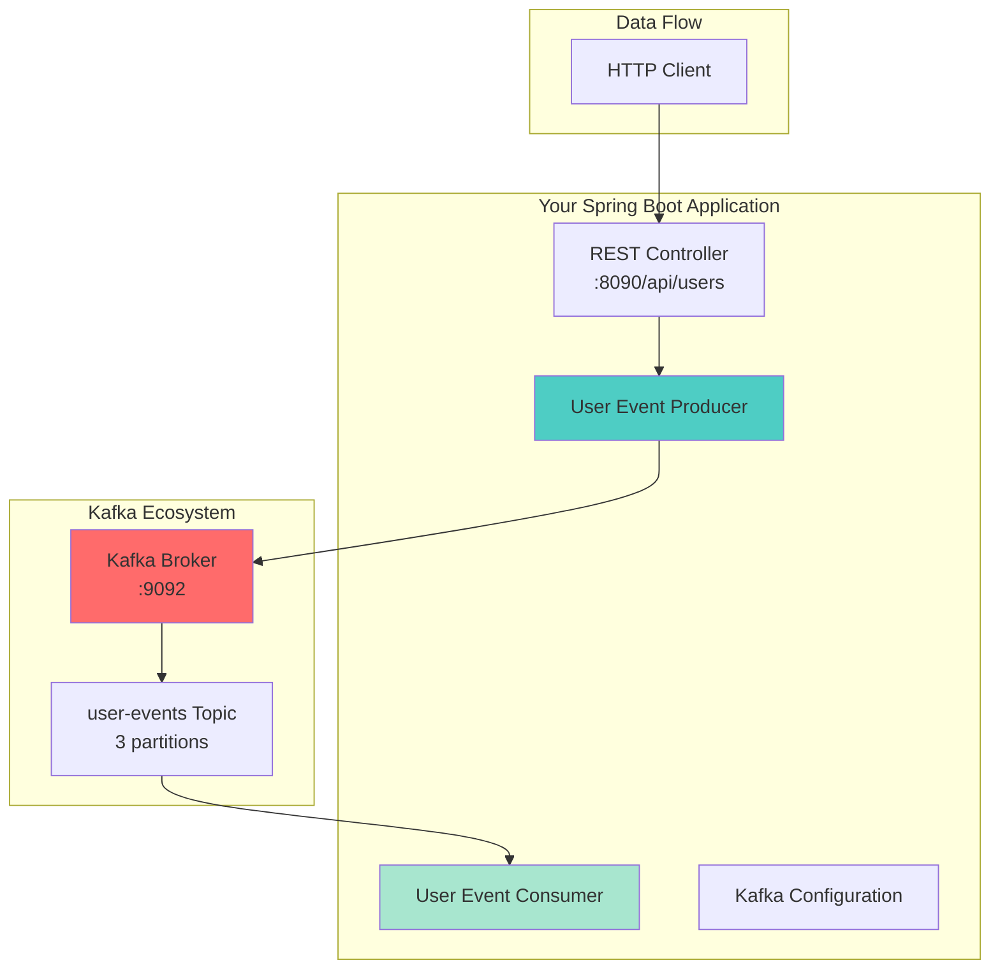
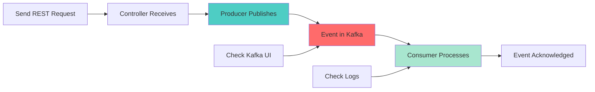

# Lesson 3 Workshop: First Producer/Consumer - Hello Kafka!

## 🎯 Objective
Build your first Kafka application with Spring Boot and Kotlin, implementing both producer and consumer patterns with proper error handling and monitoring.

## 📋 Workshop Tasks

### Task 1: Configure Kafka Integration
Complete the Spring Kafka configuration in `config/KafkaConfig.kt`

### Task 2: Create Event Models
Define your event data structures in `model/UserEvent.kt`

### Task 3: Implement Producer
Build a Kafka producer service in `service/UserEventProducer.kt`

### Task 4: Implement Consumer
Build a Kafka consumer service in `service/UserEventConsumer.kt`

### Task 5: Create REST Controller
Build REST endpoints for testing in `controller/UserController.kt`

## 🧠 Key Concepts
- Spring Boot Kafka integration
- Producer/Consumer patterns
- JSON serialization/deserialization
- Error handling and retry logic
- Consumer groups and partitioning
- Event-driven architecture basics

## 🔄 Producer-Consumer Flow


## 🏗️ Architecture Overview


## ✅ Success Criteria
- [ ] Application starts without errors
- [ ] Can send events via REST API
- [ ] Events appear in Kafka topics (check Kafka UI)
- [ ] Consumer processes events successfully
- [ ] Proper error handling implemented
- [ ] Integration tests pass

## 🚀 Getting Started

### 1. Start Your Environment
```bash
# Make sure Kafka is running from Lesson 2
cd docker
docker-compose ps

# Start your Spring Boot application
./gradlew bootRun
```

### 2. Test the API
```bash
# Create a user event
curl -X POST http://localhost:8090/api/users \
  -H "Content-Type: application/json" \
  -d '{
    "userId": "123",
    "username": "john_doe",
    "email": "john@example.com",
    "eventType": "USER_CREATED"
  }'

# Check health
curl http://localhost:8090/actuator/health
```

### 3. Monitor Events
- **Kafka UI**: http://localhost:8080/ui/clusters/local/topics/user-events
- **Application Logs**: Check console for consumer processing
- **Metrics**: http://localhost:8090/actuator/metrics

## 🔍 Event Flow Verification


## 🔧 Troubleshooting

### Common Issues:
- **Connection refused**: Ensure Kafka is running (`docker-compose ps`)
- **Serialization errors**: Check JSON format and model annotations
- **Consumer not receiving**: Verify topic name and consumer group configuration
- **Port conflicts**: Make sure port 8090 is available

### Debug Commands:
```bash
# Check topics
kafka-topics --list --bootstrap-server localhost:9092

# Monitor events in real-time
kafka-console-consumer --topic user-events --from-beginning --bootstrap-server localhost:9092

# Check consumer groups
kafka-consumer-groups --bootstrap-server localhost:9092 --list
```

## 📊 What You'll Learn
- **Event-Driven Thinking**: How to design systems around events
- **Kafka Integration**: Production-ready Spring Boot + Kafka patterns
- **Async Processing**: Benefits of decoupled, asynchronous systems
- **Error Handling**: Robust patterns for handling failures
- **Monitoring**: How to observe event-driven systems

## 🚀 Next Steps
Once you've successfully published and consumed your first events, move to [Lesson 4: Topics, Partitions & Offsets](../lesson_4/README.md) to dive deeper into Kafka's storage model!