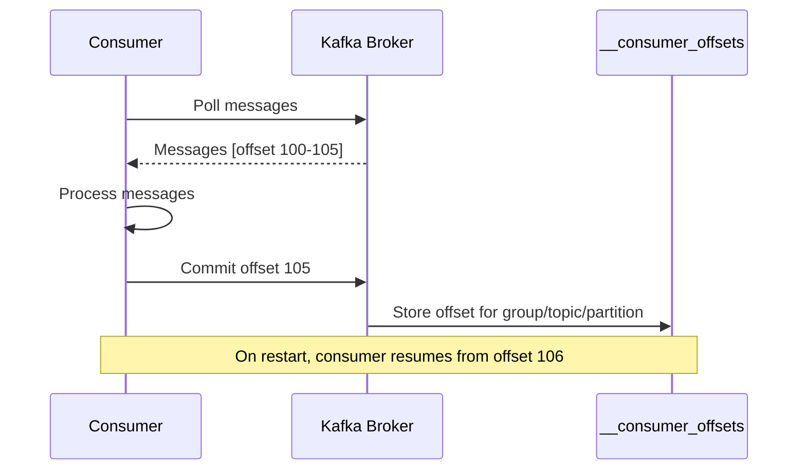
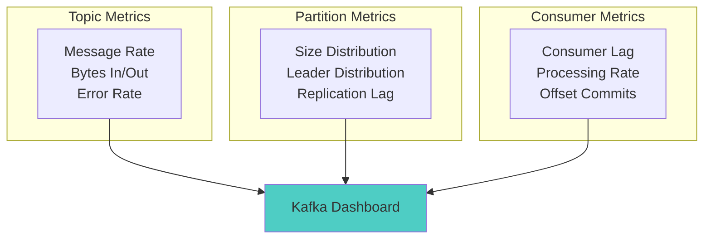

# Workshop: Topics, Partitions & Offsets

## 🎯 Objective
Master Kafka's storage model by understanding topics, partitions, and offsets. Learn how to design efficient topic structures and manage data distribution.

## 📋 Workshop Tasks

### Task 1: Topic Management
Complete the topic management operations in `management/TopicManager.kt`

### Task 2: Partition Strategy
Implement partitioning strategies in `partitioning/PartitionStrategy.kt`

### Task 3: Offset Management
Build offset tracking and management in `offset/OffsetManager.kt`

### Task 4: CLI Operations
Practice Kafka CLI commands in `cli/KafkaCliOperations.kt`

### Task 5: Performance Analysis
Analyze partition performance in `analysis/PartitionAnalyzer.kt`

## 🏗️ Kafka Storage Architecture
```mermaid
graph TB
    subgraph "Kafka Cluster"
        subgraph "Topic: user-events"
            P0[Partition 0<br/>Leader: Broker 1<br/>Offset: 0→1000]
            P1[Partition 1<br/>Leader: Broker 2<br/>Offset: 0→856]
            P2[Partition 2<br/>Leader: Broker 3<br/>Offset: 0→1200]
        end
        
        subgraph "Messages in Partition 0"
            M0[Offset 998: {user: john}]
            M1[Offset 999: {user: jane}]
            M2[Offset 1000: {user: bob}]
        end
    end
    
    subgraph "Producers"
        P[Producer] -->|key: user-id| P0
        P -->|hash(key) % 3| P1
        P --> P2
    end
    
    subgraph "Consumers"
        C1[Consumer 1<br/>Group: analytics] --> P0
        C2[Consumer 2<br/>Group: analytics] --> P1
        C3[Consumer 3<br/>Group: analytics] --> P2
    end
    
    style P0 fill:#ff6b6b
    style P1 fill:#4ecdc4
    style P2 fill:#a8e6cf
```

## 🎯 Key Concepts

### **Topics**: Logical Event Categories
- Named streams of events (e.g., `user-events`, `order-events`)
- Append-only logs with configurable retention
- Logical containers for related events

### **Partitions**: Physical Storage Units
- Topics split into ordered, immutable sequences
- Enable parallel processing and scalability
- Each partition has a leader and replicas

### **Offsets**: Message Positions
- Unique, sequential identifiers within partitions
- Enable precise message tracking and replay
- Consumer progress tracking mechanism

## 📊 Partitioning Strategies

### 1. **Key-Based Partitioning**
```mermaid
graph LR
    subgraph "Message Keys"
        K1[user-123]
        K2[user-456] 
        K3[user-789]
    end
    
    subgraph "Hash Function"
        H[hash(key) % partitions]
    end
    
    subgraph "Partitions"
        P0[Partition 0]
        P1[Partition 1]
        P2[Partition 2]
    end
    
    K1 --> H
    K2 --> H
    K3 --> H
    H --> P0
    H --> P1
    H --> P2
    
    style H fill:#ffe66d
```

**Benefits:**
- Guarantees message ordering per key
- Related events stay together
- Enables stateful processing

### 2. **Round-Robin Partitioning**
- Messages distributed evenly across partitions
- No ordering guarantees
- Good for maximum throughput

### 3. **Custom Partitioning**
- Business logic determines partition assignment
- Geographic distribution
- Load balancing strategies

## 🔄 Consumer Offset Management



### Offset Commit Strategies:
1. **Auto-commit**: Automatic offset commits at intervals
2. **Manual commit**: Explicit offset control after processing
3. **Sync commit**: Blocking commit for guaranteed persistence
4. **Async commit**: Non-blocking commit for better performance

## ✅ Success Criteria
- [ ] Can create topics with specific partition counts
- [ ] Understand how messages distribute across partitions
- [ ] Can manage consumer offsets manually
- [ ] Demonstrate message ordering within partitions
- [ ] CLI operations working correctly
- [ ] Performance analysis completed

## 🚀 Hands-On Exercises

### 1. Topic Creation
```bash
# Create topic with 3 partitions
kafka-topics --create --topic workshop-topic \
  --partitions 3 --replication-factor 1 \
  --bootstrap-server localhost:9092

# Describe topic details
kafka-topics --describe --topic workshop-topic \
  --bootstrap-server localhost:9092
```

### 2. Partition Distribution Testing
```bash
# Send messages with keys
kafka-console-producer --topic workshop-topic \
  --property "parse.key=true" \
  --property "key.separator=:" \
  --bootstrap-server localhost:9092

# Input: user-1:{"message": "hello"}
# Input: user-2:{"message": "world"}
```

### 3. Offset Inspection
```bash
# Check consumer group offsets
kafka-consumer-groups --bootstrap-server localhost:9092 \
  --group my-group --describe

# Reset offsets to beginning
kafka-consumer-groups --bootstrap-server localhost:9092 \
  --group my-group --topic workshop-topic \
  --reset-offsets --to-earliest --execute
```

## 📈 Performance Considerations

### Partition Count Guidelines:
- **Too few**: Limits parallelism and throughput
- **Too many**: Increases overhead and complexity
- **Rule of thumb**: Start with 2-3× expected consumer count

### Factors to Consider:
1. **Throughput requirements**
2. **Number of consumers**
3. **Message size and frequency**
4. **Retention requirements**
5. **Cluster resources**

## 🔧 Best Practices

### Topic Design:
- Use descriptive, consistent naming conventions
- Plan partition count for future growth
- Consider retention policies based on use case
- Group related events in same topic when possible

### Partitioning Strategy:
- Use meaningful keys for related message ordering
- Avoid hot partitions (uneven distribution)
- Monitor partition sizes and consumer lag
- Plan for partition rebalancing

### Offset Management:
- Choose commit strategy based on delivery guarantees
- Monitor consumer lag for performance issues
- Implement proper error handling for commit failures
- Use manual commits for exactly-once processing

## 🔍 Monitoring & Observability



### Key Metrics:
- **Topic**: Message throughput, error rates
- **Partition**: Size distribution, leader balance
- **Consumer**: Lag, processing rate, commit success

## 🚀 Next Steps
Master the storage fundamentals? Time to add schemas! Move to [Lesson 5: Schema Registry](../lesson_5/README.md) to learn about structured data management and evolution.