# Lesson 7 Workshop: Consumer Groups & Load Balancing

## 🎯 Objective
Master Kafka consumer groups for scalable, fault-tolerant message processing. Learn partition assignment strategies, rebalancing mechanisms, and how to design consumer applications that scale horizontally.

## 📋 Workshop Tasks

### Task 1: Consumer Group Configuration
Configure consumer groups in `config/ConsumerGroupConfig.kt`

### Task 2: Multi-Consumer Implementation
Build scalable consumers in `consumer/ScalableOrderConsumer.kt`

### Task 3: Partition Assignment Strategies
Implement assignment strategies in `assignment/PartitionAssignmentManager.kt`

### Task 4: Rebalancing Handling
Handle rebalancing gracefully in `rebalancing/RebalanceListener.kt`

### Task 5: Load Balancing Analysis
Analyze consumer performance in `analysis/LoadBalancingAnalyzer.kt`

## 🏗️ Consumer Group Architecture


## 🔄 Consumer Group Rebalancing


## 🎯 Key Concepts

### **Consumer Groups**
- **Logical grouping** of consumers for parallel processing
- **Load balancing** - partitions distributed across group members
- **Fault tolerance** - automatic rebalancing when consumers fail
- **Scaling** - add/remove consumers without downtime

### **Partition Assignment Strategies**

#### **1. Range Assignment (Default)**


#### **2. Round-Robin Assignment**


#### **3. Sticky Assignment**
- **Minimizes movement** during rebalancing
- **Preserves state** in stateful applications
- **Better performance** for stream processing

### **Rebalancing Triggers**
- **Consumer joins** the group
- **Consumer leaves** the group (graceful shutdown)
- **Consumer fails** (heartbeat timeout)
- **Topic metadata changes** (partition count increase)

## ⚖️ Load Balancing Strategies

### Even Distribution Analysis

```mermaid
graph TB
    subgraph "Partition Load Distribution"
        subgraph "Balanced Load"
            BP0[P0: 1000 msg/min]
            BP1[P1: 980 msg/min]
            BP2[P2: 1020 msg/min]
            GOOD[✅ Good Distribution<br/>Max variance: 4%]
        end
        
        subgraph "Unbalanced Load"
            UP0[P0: 100 msg/min]
            UP1[P1: 2000 msg/min]
            UP2[P2: 200 msg/min]
            BAD[❌ Poor Distribution<br/>Hot partition detected]
        end
    end
    
    subgraph "Consumer Performance"
        C1M[Consumer 1: 95% CPU]
        C2M[Consumer 2: 45% CPU]
        C3M[Consumer 3: 30% CPU]
        UNEVEN[⚠️ Uneven Resource Usage]
    end
    
    style GOOD fill:#4ecdc4
    style BAD fill:#ff6b6b
    style UNEVEN fill:#ffe66d
```


### Scaling Patterns


## ✅ Success Criteria
- [ ] Multiple consumers in same group process different partitions
- [ ] Consumer failure triggers automatic rebalancing
- [ ] Load is distributed evenly across consumers
- [ ] Partition assignment strategy can be configured
- [ ] Rebalancing is handled gracefully without message loss
- [ ] Consumer lag monitoring shows balanced processing
- [ ] Scaling up/down works without downtime

## 🚀 Getting Started

### 1. Start Multiple Consumer Instances
```bash
# Terminal 1 - Start first consumer
./gradlew bootRun --args="--consumer.instance=1"

# Terminal 2 - Start second consumer  
./gradlew bootRun --args="--consumer.instance=2"

# Terminal 3 - Start third consumer
./gradlew bootRun --args="--consumer.instance=3"
```

### 2. Generate Test Load
```bash
# Generate orders to see load distribution
curl -X POST http://localhost:8090/api/orders/generate \
  -H "Content-Type: application/json" \
  -d '{"count": 1000, "ratePerSecond": 50}'
```

### 3. Monitor Consumer Groups
```bash
# Check consumer group status
kafka-consumer-groups --bootstrap-server localhost:9092 \
  --group order-processors --describe

# Monitor consumer lag
kafka-consumer-groups --bootstrap-server localhost:9092 \
  --group order-processors --describe --verbose
```

## 🔧 Consumer Group Configuration

### Basic Configuration
```kotlin
@Configuration
class ConsumerGroupConfig {
    
    @Bean
    fun orderProcessorConsumerFactory(): ConsumerFactory<String, OrderEvent> {
        val props = mapOf(
            ConsumerConfig.BOOTSTRAP_SERVERS_CONFIG to "localhost:9092",
            ConsumerConfig.GROUP_ID_CONFIG to "order-processors",
            ConsumerConfig.KEY_DESERIALIZER_CLASS_CONFIG to StringDeserializer::class.java,
            ConsumerConfig.VALUE_DESERIALIZER_CLASS_CONFIG to JsonDeserializer::class.java,
            
            // Consumer group specific settings
            ConsumerConfig.PARTITION_ASSIGNMENT_STRATEGY_CONFIG to "org.apache.kafka.clients.consumer.RangeAssignor",
            ConsumerConfig.SESSION_TIMEOUT_MS_CONFIG to 30000,
            ConsumerConfig.HEARTBEAT_INTERVAL_MS_CONFIG to 3000,
            ConsumerConfig.MAX_POLL_INTERVAL_MS_CONFIG to 300000,
            ConsumerConfig.MAX_POLL_RECORDS_CONFIG to 500
        )
        
        return DefaultKafkaConsumerFactory(props)
    }
}
```

### Advanced Rebalancing Configuration
```kotlin
@KafkaListener(
    topics = ["order-events"],
    groupId = "order-processors",
    containerFactory = "orderProcessorListenerFactory"
)
fun processOrder(
    @Payload order: OrderEvent,
    @Header(KafkaHeaders.RECEIVED_PARTITION_ID) partition: Int,
    consumer: Consumer<String, OrderEvent>
) {
    logger.info("Processing order ${order.orderId} from partition $partition")
    
    try {
        // Process the order
        orderProcessingService.processOrder(order)
        
        // Manual commit after successful processing
        consumer.commitSync()
        
    } catch (e: Exception) {
        logger.error("Failed to process order ${order.orderId}", e)
        // Don't commit - message will be retried
    }
}
```

## 📊 Monitoring & Observability

### Consumer Group Metrics


### Health Check Implementation
```kotlin
@Component
class ConsumerGroupHealthIndicator : HealthIndicator {
    
    override fun health(): Health {
        val groupId = "order-processors"
        val maxAcceptableLag = 1000L
        
        return try {
            val consumerGroupInfo = getConsumerGroupInfo(groupId)
            val totalLag = consumerGroupInfo.partitions.sumOf { it.lag }
            val avgLag = totalLag / consumerGroupInfo.partitions.size
            
            if (avgLag <= maxAcceptableLag) {
                Health.up()
                    .withDetail("consumerGroup", groupId)
                    .withDetail("totalLag", totalLag)
                    .withDetail("averageLag", avgLag)
                    .withDetail("activeConsumers", consumerGroupInfo.activeMembers)
                    .build()
            } else {
                Health.down()
                    .withDetail("reason", "High consumer lag detected")
                    .withDetail("averageLag", avgLag)
                    .withDetail("threshold", maxAcceptableLag)
                    .build()
            }
        } catch (e: Exception) {
            Health.down(e).build()
        }
    }
}
```

## 🎯 Best Practices

### Consumer Group Design
- **Right-size your groups** - match consumer count to partition count
- **Plan for failures** - expect consumers to fail and design accordingly
- **Monitor rebalancing** - frequent rebalances indicate problems
- **Handle duplicates** - design idempotent consumers

### Performance Optimization
- **Batch processing** - process multiple messages together when possible
- **Async processing** - use async patterns for I/O intensive operations
- **Partition affinity** - consider sticky assignment for stateful processing
- **Resource monitoring** - watch CPU, memory, and network usage

### Scaling Guidelines
- **Scale gradually** - add/remove one consumer at a time
- **Monitor during scaling** - watch for rebalancing storms
- **Test scaling scenarios** - practice scaling operations
- **Automate scaling** - use metrics-based auto-scaling when appropriate

## 🔍 Troubleshooting

### Common Issues
1. **Frequent rebalancing** - Check heartbeat/session timeout configuration
2. **Uneven load** - Verify partition assignment strategy and message key distribution
3. **Consumer lag** - Scale up consumers or optimize processing logic
4. **Processing failures** - Implement proper error handling and retry logic

### Debug Commands
```bash
# Detailed consumer group info
kafka-consumer-groups --bootstrap-server localhost:9092 \
  --group order-processors --describe --verbose

# Reset consumer group offsets
kafka-consumer-groups --bootstrap-server localhost:9092 \
  --group order-processors --reset-offsets --to-earliest \
  --topic order-events --execute

# Monitor partition assignment
kafka-consumer-groups --bootstrap-server localhost:9092 \
  --group order-processors --describe --members --verbose
```

## 🚀 Next Steps
Consumer groups mastered? Time to handle failures gracefully! Move to [Lesson 8: Error Handling & Dead Letter Topics](../lesson_8/README.md) to learn robust error handling strategies.