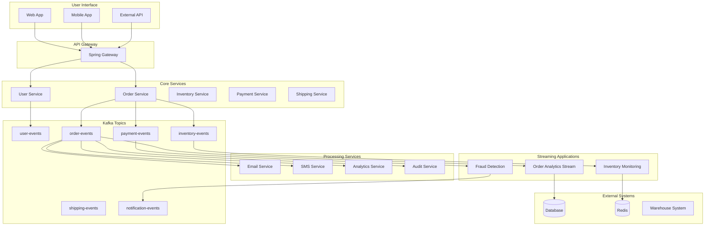

# 🎪 Demo System: Real-World Kafka Application

## 🎯 System Overview

A complete e-commerce order processing system demonstrating all major Kafka patterns learned throughout the curriculum.

## 🏗️ Architecture



## 🎯 Demonstrated Patterns

### Phase 1: Foundations
- **Basic Producer/Consumer** - Order creation events
- **Topics & Partitioning** - Customer-based partitioning
- **Schema Evolution** - Order event versioning

### Phase 2: Resilient Messaging
- **Consumer Groups** - Scalable event processing
- **Dead Letter Topics** - Failed payment handling
- **Idempotent Processing** - Duplicate order prevention
- **Fan-out Notifications** - Multi-channel alerts

### Phase 3: Stream Processing
- **Real-time Analytics** - Order processing dashboard
- **Windowed Aggregations** - Hourly sales reports
- **Stream Joins** - Order + Customer data enrichment
- **State Stores** - Customer preference caching

### Phase 4: Production Readiness
- **Security** - ACLs and authentication
- **Monitoring** - Metrics and alerting
- **Scaling** - Horizontal service scaling

## 📋 Core Workflows

### 1. Order Processing Flow
```
Customer Places Order
    ↓
Order Service → order-created event
    ↓
├── Inventory Service (reserve items)
├── Payment Service (process payment)
├── Shipping Service (calculate shipping)
├── Email Service (confirmation email)
└── Analytics Service (track metrics)
```

### 2. Inventory Management
```
Inventory Update
    ↓
Inventory Service → inventory-updated event
    ↓
├── Order Service (check pending orders)
├── Analytics Service (stock levels)
└── Notification Service (low stock alerts)
```

### 3. Real-time Dashboard
```
All Events → Kafka Streams → Aggregated Views
    ↓
Dashboard Service → WebSocket → Real-time UI
```

## 🛠️ Implementation Plan

### Service Structure
```
demo/
├── services/
│   ├── user-service/          # User registration and management
│   ├── order-service/         # Order processing logic
│   ├── inventory-service/     # Stock management
│   ├── payment-service/       # Payment processing
│   ├── shipping-service/      # Shipping calculations
│   ├── notification-service/  # Email/SMS notifications
│   └── analytics-service/     # Real-time analytics
├── streams/
│   ├── order-analytics/       # Order processing metrics
│   ├── inventory-monitor/     # Stock level monitoring
│   └── fraud-detection/       # Payment fraud detection
├── dashboard/
│   ├── api/                   # Dashboard REST API
│   └── ui/                    # React/Vue dashboard
└── docker/
    └── docker-compose.yml     # Complete system setup
```

## 📊 Event Schemas

### User Events
```kotlin
data class UserRegistered(
    val userId: String,
    val email: String,
    val name: String,
    val timestamp: Instant
)

data class UserUpdated(
    val userId: String,
    val changes: Map<String, Any>,
    val timestamp: Instant
)
```

### Order Events
```kotlin
data class OrderCreated(
    val orderId: String,
    val userId: String,
    val items: List<OrderItem>,
    val totalAmount: BigDecimal,
    val timestamp: Instant
)

data class OrderStatusChanged(
    val orderId: String,
    val oldStatus: OrderStatus,
    val newStatus: OrderStatus,
    val timestamp: Instant
)
```

### Inventory Events
```kotlin
data class InventoryReserved(
    val productId: String,
    val quantity: Int,
    val reservationId: String,
    val timestamp: Instant
)

data class StockLevelChanged(
    val productId: String,
    val oldLevel: Int,
    val newLevel: Int,
    val timestamp: Instant
)
```

## 🎮 Interactive Features

### Real-time Dashboard
- **Live Order Processing** - Watch orders flow through system
- **Inventory Levels** - Real-time stock monitoring
- **Revenue Metrics** - Streaming sales analytics
- **System Health** - Service status and performance

### Chaos Engineering
- **Service Failures** - Simulate payment service downtime
- **Network Issues** - Test partition tolerance
- **Load Testing** - Stress test with high order volume
- **Recovery Scenarios** - Practice incident response

### A/B Testing
- **Order Flow Variants** - Test different checkout processes
- **Pricing Strategies** - Dynamic pricing experiments
- **Recommendation Engine** - Product suggestion testing

## 🔧 Operational Features

### Monitoring & Alerting
- **Kafka Lag Monitoring** - Consumer lag alerts
- **Error Rate Tracking** - Failed message processing
- **Throughput Metrics** - Messages per second
- **Business Metrics** - Orders per hour, revenue trends

### Deployment Patterns
- **Blue-Green Deployment** - Zero-downtime updates
- **Canary Releases** - Gradual feature rollouts
- **Circuit Breakers** - Automatic failure handling
- **Auto-scaling** - Load-based scaling

### Security Implementation
- **API Authentication** - JWT token validation
- **Kafka ACLs** - Topic-level permissions
- **Data Encryption** - At-rest and in-transit
- **Audit Logging** - Complete event trail

## 🎯 Learning Outcomes

After working with the demo system, students will have:

### Technical Skills
✅ Built a complete event-driven microservice system  
✅ Implemented all major Kafka patterns  
✅ Set up production-like monitoring and alerting  
✅ Practiced troubleshooting and debugging  

### Architectural Understanding
✅ Designed resilient, scalable systems  
✅ Made trade-offs between consistency and availability  
✅ Implemented proper error handling strategies  
✅ Applied security best practices  

### Operational Experience
✅ Deployed and managed Kafka applications  
✅ Monitored system health and performance  
✅ Handled failures and recovery scenarios  
✅ Optimized for throughput and latency  

## 🚀 Getting Started

### Prerequisites
- Complete all 20 curriculum lessons
- Docker and Docker Compose
- 8GB+ RAM for full system

### Quick Start
```bash
cd demo
docker-compose up -d
open http://localhost:3000  # Dashboard UI
```

### Available Endpoints
- **Dashboard**: http://localhost:3000
- **Order API**: http://localhost:8081
- **Inventory API**: http://localhost:8082
- **Kafka UI**: http://localhost:8080

---

*This demo system brings together everything learned in the curriculum into a realistic, production-like application that demonstrates the power and flexibility of Kafka-based architectures.*