# Kafka Infrastructure Basics - 101 Guide

## 🏗️ Overview: The Kafka Ecosystem

Think of Kafka infrastructure like a **large apartment complex** with multiple buildings, mailboxes, and delivery systems all working together.

## 🏢 Core Infrastructure Components

### 1. **Kafka Cluster** 
The entire apartment complex
- A group of servers working together
- Provides high availability and fault tolerance
- Can span multiple data centers

```mermaid
graph TB
    subgraph KC["Kafka Cluster"]
        B1["🖥️ Broker 1<br/>ID: 0<br/>Port: 9092"]
        B2["🖥️ Broker 2<br/>ID: 1<br/>Port: 9092"]
        B3["🖥️ Broker 3<br/>ID: 2<br/>Port: 9092"]
    end
    
    style KC fill:#e1f5fe
    style B1 fill:#4fc3f7
    style B2 fill:#4fc3f7
    style B3 fill:#4fc3f7
```

### 2. **Brokers** 
Individual apartment buildings
- **What it is**: A single Kafka server in the cluster
- **What it does**: Stores and serves messages
- **Key points**:
  - Each broker has a unique ID (0, 1, 2, etc.)
  - Can handle thousands of topics and partitions
  - Automatically distributes load

### 3. **Zookeeper/KRaft** 
The management office
- **Zookeeper** (Traditional): External coordination service
- **KRaft** (New): Built-in coordination (Kafka 2.8+)
- **Responsibilities**:
  - Elects broker leaders
  - Maintains cluster metadata
  - Manages configuration

## 📋 Data Organization

### 4. **Topics** 
Different types of mailboxes (e.g., "Bills", "Personal", "Work")
- **What it is**: A category or feed name
- **Examples**: `user-activity`, `order-events`, `payment-transactions`
- **Characteristics**:
  - Identified by name
  - Can have multiple producers and consumers
  - Messages are ordered within partitions

### 5. **Partitions** 
Individual slots within each mailbox type
- **What it is**: A subdivision of a topic
- **Why needed**: Enables parallel processing and scaling
- **Key concepts**:
  - Each partition is ordered (0, 1, 2, 3...)
  - Messages get sequential IDs called "offsets"
  - More partitions = more parallelism

```mermaid
graph TB
    subgraph Topic["📋 Topic: 'user-activity'"]
        P0["📁 Partition 0<br/>Offset 0: Msg1<br/>Offset 1: Msg4"]
        P1["📁 Partition 1<br/>Offset 0: Msg2<br/>Offset 1: Msg5"]
        P2["📁 Partition 2<br/>Offset 0: Msg3<br/>Offset 1: Msg6"]
    end
    
    style Topic fill:#f3e5f5
    style P0 fill:#ce93d8
    style P1 fill:#ce93d8
    style P2 fill:#ce93d8
```

### 6. **Replication** 
Making copies for safety
- **What it is**: Each partition is copied to multiple brokers
- **Replication Factor**: Number of copies (typically 3)
- **Leadership**: One broker is "leader", others are "followers"
- **Benefit**: If one broker fails, others continue serving

```mermaid
graph LR
    subgraph Replication["🔄 Partition Replication (Factor = 3)"]
        B1["🖥️ Broker 1<br/>👑 LEADER<br/>📦 Msg1-10"]
        B2["🖥️ Broker 2<br/>👥 FOLLOWER<br/>📦 Msg1-10"]
        B3["🖥️ Broker 3<br/>👥 FOLLOWER<br/>📦 Msg1-10"]
    end
    
    B1 -->|"📨 Replicates"| B2
    B1 -->|"📨 Replicates"| B3
    
    style B1 fill:#ffb74d,color:#000
    style B2 fill:#81c784,color:#000
    style B3 fill:#81c784,color:#000
    style Replication fill:#f9f9f9
```

## 🔄 Client Components

### 7. **Producers** 
Mail senders
- **Role**: Send messages to topics
- **Smart routing**: Automatically find the right broker
- **Load balancing**: Distribute messages across partitions
- **Acknowledgments**: Can wait for confirmation

### 8. **Consumers** 
Mail receivers
- **Role**: Read messages from topics
- **Offset tracking**: Remember what they've read
- **Pull model**: Consumers request messages (not pushed)

### 9. **Consumer Groups** 
Households sharing mail delivery
- **What it is**: Multiple consumers working together
- **Load sharing**: Each partition assigned to one consumer in group
- **Scalability**: Add more consumers to process faster
- **Fault tolerance**: If one consumer fails, others take over

```mermaid
graph TB
    subgraph CG["👥 Consumer Group: 'analytics-team'"]
        P0["📁 Partition 0"]
        P1["📁 Partition 1"] 
        P2["📁 Partition 2"]
        
        CA["👤 Consumer A"]
        CB["👤 Consumer B"]
        CC["👤 Consumer C"]
    end
    
    P0 -->|"📨 assigned to"| CA
    P1 -->|"📨 assigned to"| CB
    P2 -->|"📨 assigned to"| CC
    
    style P0 fill:#e1bee7
    style P1 fill:#e1bee7
    style P2 fill:#e1bee7
    style CA fill:#a5d6a7
    style CB fill:#a5d6a7
    style CC fill:#a5d6a7
    style CG fill:#f8f9fa
```

## 🏗️ Physical Architecture Example

```mermaid
graph TB
    Internet["🌐 Internet<br/>External Clients"]
    
    subgraph LB["⚖️ Load Balancer Layer"]
        LoadBalancer["🔀 Load Balancer<br/>HAProxy/NGINX"]
    end
    
    subgraph KC["🏢 Kafka Cluster"]
        B1["🖥️ Broker 1<br/>Port: 9092<br/>📋 Topics:<br/>• orders<br/>• users<br/>• events"]
        B2["🖥️ Broker 2<br/>Port: 9092<br/>📋 Topics:<br/>• orders<br/>• users<br/>• events"]
        B3["🖥️ Broker 3<br/>Port: 9092<br/>📋 Topics:<br/>• orders<br/>• users<br/>• events"]
    end
    
    subgraph ZK["🐘 ZooKeeper Ensemble"]
        ZK1["🔧 ZooKeeper 1<br/>Port: 2181<br/>Leader Election<br/>Metadata"]
        ZK2["🔧 ZooKeeper 2<br/>Port: 2181<br/>Coordination<br/>Config"]
        ZK3["🔧 ZooKeeper 3<br/>Port: 2181<br/>Cluster State<br/>Monitoring"]
    end
    
    Internet --> LoadBalancer
    LoadBalancer --> B1
    LoadBalancer --> B2
    LoadBalancer --> B3
    
    B1 -.->|"coordinates with"| ZK1
    B2 -.->|"coordinates with"| ZK2
    B3 -.->|"coordinates with"| ZK3
    
    ZK1 <-.->|"sync"| ZK2
    ZK2 <-.->|"sync"| ZK3
    ZK3 <-.->|"sync"| ZK1
    
    style Internet fill:#e3f2fd
    style LoadBalancer fill:#fff3e0
    style B1 fill:#e8f5e8
    style B2 fill:#e8f5e8
    style B3 fill:#e8f5e8
    style ZK1 fill:#fce4ec
    style ZK2 fill:#fce4ec
    style ZK3 fill:#fce4ec
    style KC fill:#f0f4c3
    style ZK fill:#f3e5f5
    style LB fill:#e1f5fe
```

## 🔄 Complete Message Flow

```mermaid
graph TB
    subgraph Producers["📤 Producers"]
        P1["🏪 Order Service"]
        P2["👤 User Service"] 
        P3["📊 Analytics Service"]
    end
    
    subgraph KC["🏢 Kafka Cluster"]
        subgraph Topics["📋 Topics"]
            T1["📦 orders-topic<br/>Partitions: 3<br/>Replication: 3"]
            T2["👥 users-topic<br/>Partitions: 2<br/>Replication: 3"]
            T3["📈 events-topic<br/>Partitions: 4<br/>Replication: 3"]
        end
        
        subgraph Brokers["🖥️ Brokers"]
            B1["Broker 1<br/>Leader: orders-0,users-0<br/>Follower: orders-1,events-0"]
            B2["Broker 2<br/>Leader: orders-1,events-0<br/>Follower: orders-2,users-1"]
            B3["Broker 3<br/>Leader: orders-2,users-1<br/>Follower: orders-0,events-1"]
        end
    end
    
    subgraph Consumers["📥 Consumer Groups"]
        subgraph CG1["👥 payment-processors"]
            C1["💳 Payment App 1"]
            C2["💳 Payment App 2"]
        end
        
        subgraph CG2["👥 analytics-team"]
            C3["📊 Data Pipeline"]
            C4["📈 Real-time Dashboard"]
        end
    end
    
    P1 -->|"📨 send orders"| T1
    P2 -->|"📨 send user data"| T2
    P3 -->|"📨 send events"| T3
    
    T1 -->|"📖 consume orders"| C1
    T1 -->|"📖 consume orders"| C2
    T2 -->|"📖 consume users"| C3
    T3 -->|"📖 consume events"| C4
    
    style P1 fill:#ffcdd2
    style P2 fill:#ffcdd2
    style P3 fill:#ffcdd2
    style T1 fill:#e1f5fe
    style T2 fill:#e1f5fe
    style T3 fill:#e1f5fe
    style C1 fill:#c8e6c9
    style C2 fill:#c8e6c9
    style C3 fill:#c8e6c9
    style C4 fill:#c8e6c9
    style KC fill:#f9fbe7
```

## 🎯 Key Infrastructure Principles

### **High Availability**
- Multiple brokers ensure no single point of failure
- Automatic failover when brokers go down
- Data replication across different machines

### **Scalability**
- Add more brokers to handle more data
- Add more partitions for parallel processing
- Add more consumers to process faster

### **Durability**
- Messages stored on disk, not just memory
- Configurable retention (time or size based)
- Replication ensures data survival

### **Performance**
- Sequential disk writes (very fast)
- Zero-copy transfers
- Batch processing capabilities

## 📊 Typical Setup Sizes

| **Environment** | **Brokers** | **Partitions/Topic** | **Replication** |
|----------------|-------------|---------------------|-----------------|
| Development    | 1           | 1-3                 | 1               |
| Testing        | 3           | 3-6                 | 2               |
| Production     | 3-100+      | 6-50+               | 3               |

This infrastructure setup allows Kafka to handle massive scale while maintaining reliability and performance!
